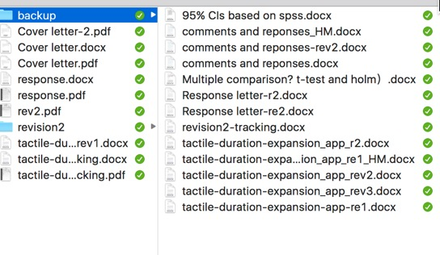

```{r setup, include=FALSE}
source('loadPackages.R')
knitr::opts_chunk$set(echo = FALSE)
options(xtable.comment=FALSE, fig.width = 4, fig.height=3, digits = 2) #hide  comments
```

## shared folder

https://goo.gl/1KIMnQ

## A survey

* How many times do you usually repeat for analyzing the same dataset?
- Have you ever experienced big mistakes simply due to small coding errors or dumb copy-and-paste?
- Do you feel a need for filling a gap between data analysis and writing?

## Estimation of my time spent on Research

```{r, out.width='0.8\\textwidth', fig.align='center'}
types <- c("Literature Review", "Study realization","Data collection and Analysis",'Refining design and analysis', "Writing")
slices <- c(0.2, 0.1, 0.1,0.4, 0.2)
pie(slices, labels = types)
```

## Traditional approach

Traditional tools: __SPSS, Matlab, R__ and __Word__

- problems occur for multiple experiments and data mining
- copy-and-past is error-prone
- data and files are separated, independent
- codes are not reusuable
- multiple copies

## Reproducible Research (RR)

An ideal RR process should be able to adapt to flexible research process:

- easy to expand experiments and data analyses
- easy to maintain codes and text
- easy to replot figures and to output statistics 

```{r, out.width='0.35\\textwidth', fig.align='center'}
knitr::include_graphics('./figs/repeats.png')
```

## Git, R, Markdown, and Knitr /Pandoc
- git for version controls (e.g., multiple experiments, minor variations)
- R for data analysis
- RMarkdown for writing
- Knitr / Pandoc for universal document converters

```{r, out.width='0.35\\textwidth', fig.align='center'}
knitr::include_graphics('./figs/bridge.jpg')
```

## Examples of RR

- An except from my own study - audiovisual temporal integration in AM
- [The book 'Reproducible Research with R and RStudio'](http://christophergandrud.GitHub.io/RepResR-RStudio/) 
- The book [Pro Git](https://github.com/progit/progit2.git)
- A demo from Lakens/perfect-t-test ^[_Ondrej_ mentioned this, thanks.]

    [Lakens/perfect-t-test.git](https://github.com/Lakens/perfect-t-test.git)

## First step: organizing your data and files

- literature
  - Mendeley 
- experimental codes (matlab, R) and data
  - dropbox / owncloud with git
- git for managing different versions and changes

## multiple version of documents

Traditional manual version control:

- error prone
- difficult to find a right version

```{r, out.width='0.35\\textwidth', fig.align='center'}

```

__git__ can help you solve this problem

## what is git

- A widely used source code version control system
- Distributed system
- Developed by Linus Torvalds (father of Linux system)

## what is git

- Managing codes, files for collaboration
- Adopted by many applications
  - Psychtoolbox
  - Matlab
  - R
- Open source codes
  - Github.com
  - Bitbucket.org
  - ...

## Benefits of using git in research

- Managing experimental codes
  - Reusing codes for multiple experiments
  - Tracking various changes
  - Playground for your new projects
- Tracking your data analyses and writing
  - Data minging requires multiple tries
  - Multiple revisions of a manuscript
- Collaborating
  - Parallel data analyses / writing
  
## git basics
- Initializing a Repository in an Existing Directory

  `git init`
  
- Tracking New Files

  `git add FILENAME`
  
- Committing your changes

  `git commit –m ”Version 9: new methods”`
  
- Viewing your changes

  `git diff `
  
- Viewing history

  `git log`

## Working with remove clouds

- Cloning an Existing Repository

  `git clone https://github.com/christophergandrud/Rep-Res-Book.git`

- Adding remote repositories

  `git remote add [shortname] [url]`
  
- Fetching and Pulling from Remotes

  `git fetch [remote-name]`
  
  `git pull [remote-name]	`
   (difference from fetch: fetch and merge with local)

- Pushing to your remotes

  `git push origin master`
  
- Tagging

  `git tag`

## Git GUI clients

You can find many git GUI clients in its [official website](https://git-scm.com/downloads/guis), e.g.:

- [SourceTree](https://www.sourcetreeapp.com)
- [GitHub Desktip](https://desktop.github.com)
- [TortoiseGit](https://tortoisegit.org)

## Git in RStudio and Matlab

Git is integrated in latest RStudio and Matlab. You can direct do git tasks inside R or Matlab. 


## Course schedule
```{r, comment=NA,message=FALSE, results='asis'}
dates <- seq(as.Date('2016-04-14'), length.out = 6,by='2 weeks')
dates[6] <- dates[6] + 7 # move one week later due to conference
dates <- as.character(dates) # bug in xtable
contents <- c('Version control system - git', 
              'Data import and manipulation',
              'Publication-ready figures',
              'Statstics and Modeling',
              'Reusable data analysis',
              'RMarkdown and writing')
kable(data.frame(dates, contents))
```


