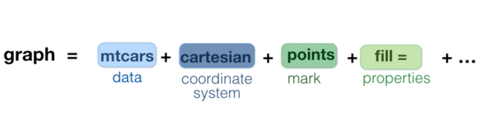

  
  ```{r setup, include=FALSE}
source('loadPackages.R')
options(xtable.comment=FALSE, fig.width = 4, fig.height=3, digits = 2) #hide  comments
```

## Github repository

> git clone https://github.com/strongway/seminar-reproducible-research.git

## R basic plots
```{r}
plot(mtcars$wt, mtcars$mpg)
```


## R basic plots
```{r}
hist(mtcars$mpg)

```


## R basic plots
```{r}
barplot(table(mtcars$gear))
```

## Two powerful packages

- ggplot2
    - grammar of graphics
    - It takes care of many of the fiddle details
    
http://docs.ggplot2.org/

- ggvis
    - grammar of graphics
    - heavily use pipe %>%
    - Interactive
    
http://ggvis.rstudio.com

## Package - ggplot

three key components

- a data set
- a _coordinate system_
- a set of _geoms_
    - layer by layer

```{r, out.width='60%', fig.align='center', echo=FALSE}

```

> ggplot(mtcars, aes(x=mpg, y = hp, color = gear)) + geom_point() + geom_smooth()


## ggplot grammar


```{r, out.width='90%', fig.align='center', echo=FALSE}
include_graphics('./figs/ggplot.pdf')
```

## ggplot examples

```{r ,out.width='75%', fig.align='center'}
ggplot(diamonds, aes(x = carat, y = price, color = cut)) + 
  geom_point()

```


## ggplot examples

```{r ,out.width='75%', fig.align='center'}
ggplot(diamonds, aes(x = carat)) + geom_histogram()
```

## ggplot examples

```{r,out.width='75%', fig.align='center'}
diamonds %>% filter (cut == "Fair") %>% ggplot(., aes(x = carat, y = price)) + 
  geom_point() + geom_smooth(method = 'lm')
```

## Package ggvis

- relative young, still under development
- powerful for interactive
- better consistent grammars than ggplot
      - data
      - coordinate system, 
      - properties: marks, colors, lines
      
Tutorial Video:

https://campus.datacamp.com/courses/ggvis-data-visualization-r-tutorial/chapter-one-the-grammar-of-graphics?ex=4


## Basic grammar of ggvis

`dataset %>% ggvis(~x, ~y, fill = ~variable, ...) %>% layer_<mark>()`

e.g., 

> mtcars %>% ggvis(x = ~mpg, y = ~hp, fill = ~cyl) %>% 
  layer_points() %>% layer_smooths() %>% 
  layer_model_predictions(model='lm', stroke := 'red' )


